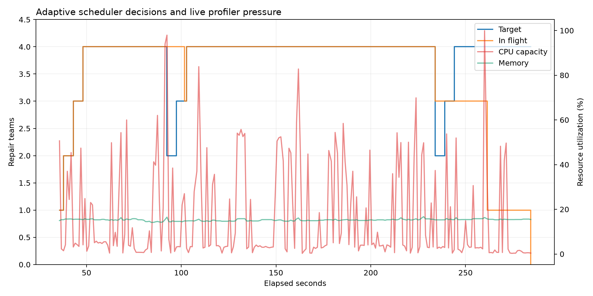

# Agency Mini-SWE: Profile-Guided Dynamic Agent Scaling

## Summary

This project implements a profile-guided autoscaler for an end-to-end Agency
bug-fix loop. A read-only planning agent diagnoses a failing QuixBugs program, a
build agent repairs it in the same isolated sandbox, and an independent harness
reruns pristine tests. A new live `agprof` API feeds CPU and memory pressure to
an additive-increase/multiplicative-decrease scheduler, which changes the
number of concurrent repair teams while the benchmark is running.

## Dataset

QuixBugs is an academic automated-program-repair benchmark containing 40 short
Python and Java programs with real defects and tests. This experiment uses
twelve Python tasks spanning arithmetic, recursion, search, parsing, state
tracking, dynamic programming, sorting, combinatorics, and bit manipulation.
The exact upstream revision, expected baseline behavior, and task paths are
recorded in `tasks.json`.

To prevent answer leakage, each task receives a fresh checkout without:

- `correct_python_programs`
- Java reference programs
- Git history

The harness requires every original program to fail its targeted pytest case
before allowing the agent to run. The publication harness also disables
container networking, restores pristine benchmark inputs before verification,
and rejects any change outside the target program. A post-run audit of the
recorded trajectories and workspaces confirmed that the reported runs used only
local read/edit/pytest operations and did not alter protected files.

## Workflow

1. Copy a pinned QuixBugs checkout into an isolated task workspace.
2. Run the targeted pytest case and retain its failure output.
3. Ask `agplan` to inspect the program and tests and produce a diagnosis.
4. Pass the diagnosis to `agbuild` in the same sandbox.
5. Independently rerun pytest and save the resulting patch.
6. Poll live profiler pressure and task completions, then adjust the target
   number of in-flight teams without cancelling active repairs.
7. Persist every scheduling decision and aggregate repair and profiler metrics.

## Experimental setup

- Host: AWS EC2 `t3.medium` (2 vCPU, 4 GB RAM, 4 GB swap), Ubuntu Server 26.04
- Sandbox runtime: Docker, CPU-only Agency image
- LLM: supplied remote vLLM endpoint
- Model: `Qwen/Qwen3.5-122B-A10B-FP8`
- Policies: fixed concurrency 1, 2, and 4; adaptive concurrency 1–4
- Repetitions: 3 complete profiled runs per policy
- Total evaluated repairs: 144 (12 tasks × 4 policies × 3 repetitions)

The live endpoint is shared, so model latency is not controlled. Repeated runs
and profiler decomposition are used to distinguish endpoint wait from local
CPU, I/O, sandbox, and scheduling overhead.

## Adaptive policy

`agprof.live_metrics()` converts consecutive cgroup samples into an immutable
snapshot of CPU capacity usage, memory pressure, sample age, and active
sandboxes. The scheduler starts one repair team, adds one slot after three
healthy samples, and applies a cooldown between changes. Sustained CPU or
memory pressure halves the target; a task failure or large completed-task
latency regression triggers the same reduction immediately. Scale-down never
cancels a repair already in progress.

Every one-second decision is written to `scheduler_events.jsonl`, including the
input telemetry, queue depth, target and actual concurrency, action, and reason.
Fixed policies use the same sliding-window scheduler and artifact format, so
their only intentional difference is the concurrency policy.

## Results

All **144/144 repair attempts** passed their original tests after the agent's
patch. Mean profiled wall time was:

- **708.5 s** at fixed concurrency 1
- **416.7 s** at fixed concurrency 2
- **304.8 s** at fixed concurrency 4
- **313.1 s** with adaptive concurrency 1–4

Adaptive scheduling delivered a **2.26× speedup** and **55.8% wall-time
reduction** over fixed concurrency 1. Successful-repair throughput increased
from **0.0171/s to 0.0391/s**. It was **2.7% slower than fixed 4** on mean wall
time, so the experiment does not claim that adaptation beats an oracle-like
fixed setting chosen after measurement. Instead, it approached that setting
without assuming it in advance and reduced mean peak memory from **709.7 MB to
634.8 MB**.

The dots are individual runs, bars are three-run means, and error bars are 95%
confidence intervals. Machine-readable aggregates are in
[`artifacts/aggregate.json`](artifacts/aggregate.json).

## Profile findings

The profiles explain the throughput/latency tradeoff:

- Mean workload CPU rose from **15.3 core-percent** at fixed 1 to **37.7** at
  fixed 4 and **36.5** adaptively. Much of the workflow waits on the remote
  model, so four teams still did not saturate the two-vCPU host.
- Mean task latency rose from **55.4 s** at fixed 1 to **78.0 s** at fixed 4
  and **77.5 s** adaptively. Parallel execution completed the queue sooner
  while each repair experienced greater endpoint and host contention.
- Mean LLM time to first token increased from **675 ms** at fixed 1 to **916
  ms** at fixed 4; adaptive execution averaged **871 ms**.
- Docker admission remained negligible: adaptive `sync:container` p95 was
  **0.25–0.34 ms**. The scheduler itself had roughly **0.2 ms p50** tick
  latency and about **2.8 s total measured overhead** per run.
- Adaptive runs averaged **3.41 active teams**. Across three repetitions the
  controller recorded **13 scale-ups and 3 scale-downs**, including reductions
  after task-latency spikes, while preserving a 100% repair rate.

The representative timeline shows the controller ramping from one to four
teams, backing off when pressure criteria fired, and refilling available
capacity. Complete task results and scheduler logs plus compact profile
summaries for all twelve runs are under
[`artifacts/scaling`](artifacts/scaling).

## Screenshots

Both figures are generated directly from `agprof` summaries and
`scheduler_events.jsonl`. Raw Perfetto traces are omitted from Git because of
their size; the compact machine-readable summaries needed to reproduce the
figures are included.

## Limitations

- The EC2 instance is burstable and has only two vCPUs; CPU-credit state may
  affect repeated measurements.
- The vLLM endpoint is remote and shared.
- QuixBugs programs are intentionally small and mostly single-line defects.
- Twelve tasks and three repetitions produce wide confidence intervals and are
  a systems demonstration, not a statistically robust model-quality study.
- The policy uses live CPU/memory samples and completed-task latency; live LLM
  TTFT remains available only when each request completes.
- Agent trajectories were not identical across repetitions. The experiment
  therefore measures complete workflow behavior rather than a deterministic
  microbenchmark.

## Reproduction

See `capstone/README.md` for environment setup, benchmark commands, profiling,
and artifact collection.

