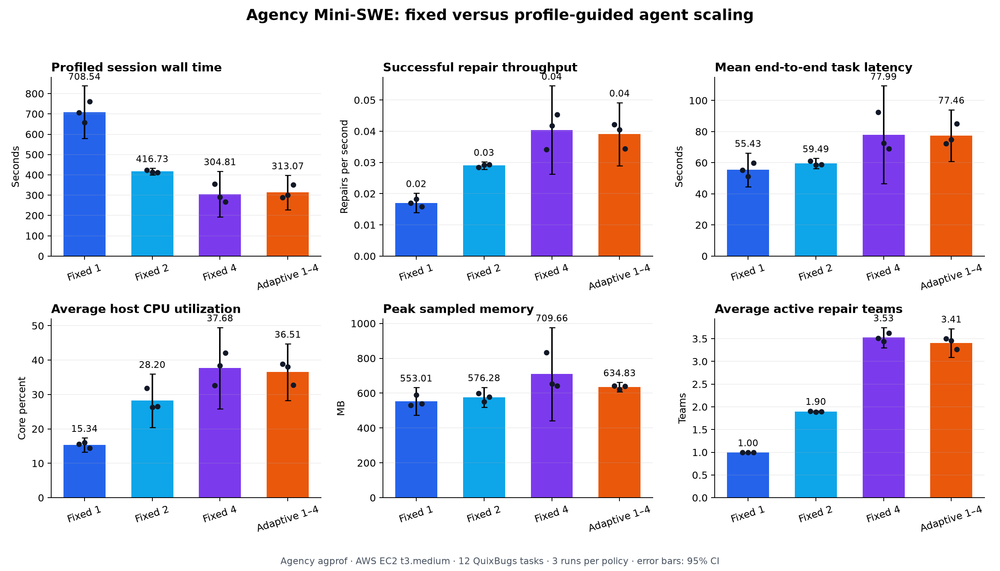

# Agency Mini-SWE: Profiled Program Repair

## Summary

This project implements an end-to-end bug-fix loop in Agency. A read-only
planning agent diagnoses a failing QuixBugs program, a build agent repairs it in
the same isolated sandbox, and an independent harness reruns the original test
to determine success. The experiment compares sequential execution with
two-task parallel fan-out.

## Dataset

QuixBugs is an academic automated-program-repair benchmark containing 40 short
Python and Java programs with real defects and tests. This experiment uses six
non-graph Python tasks spanning arithmetic, recursion, state tracking, dynamic
programming, sorting, and bit manipulation. The exact upstream revision and
task paths are recorded in `tasks.json`.

To prevent answer leakage, each task receives a fresh checkout without:

- `correct_python_programs`
- Java reference programs
- Git history

The harness requires every original program to fail its targeted pytest case
before allowing the agent to run. The publication harness also disables
container networking, restores pristine benchmark inputs before verification,
and rejects any change outside the target program. A post-run audit of the
recorded trajectories and workspaces confirmed that the reported runs used only
local read/edit/pytest operations and did not alter protected files.

## Workflow

1. Copy a pinned QuixBugs checkout into an isolated task workspace.
2. Run the targeted pytest case and retain its failure output.
3. Ask `agplan` to inspect the program and tests and produce a diagnosis.
4. Pass the diagnosis to `agbuild` in the same sandbox.
5. Independently rerun pytest and save the resulting patch.
6. Aggregate repair outcomes and Agency profiler statistics.

## Experimental setup

- Host: AWS EC2 `t3.medium` (2 vCPU, 4 GB RAM, 4 GB swap), Ubuntu Server 26.04
- Sandbox runtime: Docker, CPU-only Agency image
- LLM: supplied remote vLLM endpoint
- Model: `Qwen/Qwen3.5-122B-A10B-FP8`
- Parallelism: 1 (sequential) versus 2 (parallel)
- Repetitions: 2 complete profiled runs per mode
- Total evaluated repairs: 24 (6 tasks × 2 modes × 2 repetitions)

The live endpoint is shared, so model latency is not controlled. Repeated runs
and profiler decomposition are used to distinguish endpoint wait from local
CPU, I/O, sandbox, and scheduling overhead.

## Results

All 24 repair attempts passed their original tests after the agent's patch. The
sequential runs took 409.7 s and 428.5 s; the two-agent runs took 323.8 s and
309.6 s.

Across repetitions:

- Mean profiled wall time fell from **419.1 s to 316.7 s**, a **24.4% reduction**
  and **1.32× speedup**.
- Successful skill-run throughput increased from **0.0286/s to 0.0379/s**
  (**32.3%**).
- Mean per-task latency increased from **47.3 s to 54.8 s** (**15.9%**). Fan-out
  improved batch completion time while individual tasks experienced more host
  and endpoint contention.
- Repair quality remained unchanged at **100% (12/12) per mode**.

The dots are individual runs and bars are two-run means. Machine-readable
aggregates are in [`artifacts/aggregate.json`](artifacts/aggregate.json); each
run also includes task-level outputs, patches, and the complete profiler
summary.

## Profile findings

The profile explains why two-way fan-out helped batch throughput but increased
individual latency:

- Average host CPU utilization rose from **40.6% to 54.1%**, while peak sampled
  memory increased only from **511.9 MB to 531.5 MB**. Parallelism used the
  small EC2 host more effectively without approaching its memory limit.
- Mean LLM time to first token rose from **659 ms to 746 ms**. Total LLM wait
  averaged 196.6 s sequentially and 230.7 s in parallel, consistent with
  concurrent requests sharing the remote endpoint.
- Docker CLI admission was not the bottleneck: `sync:container` p95 was roughly
  0.20 ms sequentially and 0.25 ms in parallel.
- Container and mounted-file overhead did increase. Mean total `sandbox:start`
  time was 11.1 s per sequential run versus 12.9 s per parallel run; read-file
  p95 increased from about 375 ms to 522 ms.
- Explicit `agsync:join` blocked for a mean total of 283.4 s sequentially and
  180.4 s in parallel. This is expected waiting rather than CPU work and is the
  clearest profile-level view of the fan-out benefit.

Raw profiler output is preserved in:

- [`artifacts/sequential/profile_summary.md`](artifacts/sequential/profile_summary.md)
- [`artifacts/sequential_2/profile_summary.md`](artifacts/sequential_2/profile_summary.md)
- [`artifacts/parallel/profile_summary.md`](artifacts/parallel/profile_summary.md)
- [`artifacts/parallel_2/profile_summary.md`](artifacts/parallel_2/profile_summary.md)

## Screenshots

The comparison figure above is generated directly from `agprof`'s
`summary.json` files. Representative raw Perfetto traces from the first run of
each mode are retained locally as `artifacts/*/trace.json`; they are omitted
from Git because they total approximately 10 MB and can be attached to a GitHub
release.

## Limitations

- The EC2 instance is burstable and has only two vCPUs; CPU-credit state may
  affect repeated measurements.
- The vLLM endpoint is remote and shared.
- QuixBugs programs are intentionally small and mostly single-line defects.
- Six tasks are enough for a tryout demonstration, not a statistically robust
  model-quality evaluation.
- Agent trajectories were not identical across repetitions: model tool choices
  produced 39–44 LLM calls per run. The experiment therefore measures complete
  workflow behavior rather than a deterministic microbenchmark.

## Reproduction

See `capstone/README.md` for environment setup, benchmark commands, profiling,
and artifact collection.

